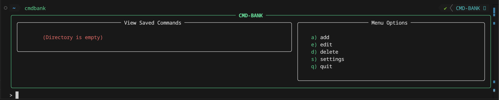
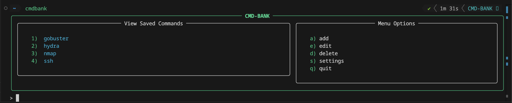
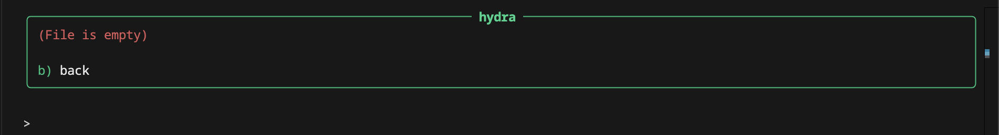
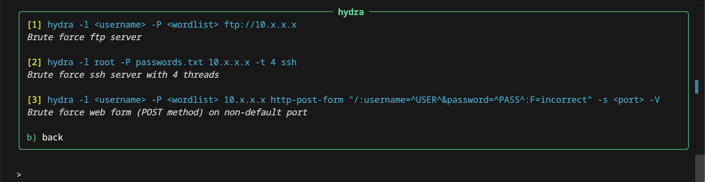
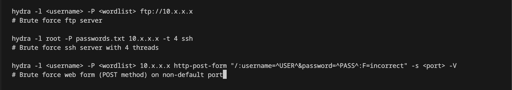

 


# CMD-BANK

CMD-BANK is a command line application that allows you to save and retrieve your favourite commands directly from the terminal.<br>

## Contents
1. [Install / uninstall](#install--uninstall)
2. [User guide](#user-guide)
3. [What is being installed and where?](#what-is-being-installed-and-where)


## Install / uninstall

### Install with pipx:
```
pipx install https://github.com/NateHartley/CMD-BANK/archive/refs/tags/v1.0.0.tar.gz
```

### Install from source code:
```
git clone https://github.com/NateHartley/CMD-BANK.git
cd <PATH>/CMD-BANK
pipx install -e .
```

### Uninstall:
```
pipx uninstall cmdbank
```

## User guide
### Run:
```
cmdbank
```
<br>
(Colours and saturations may be different depending on your shell's config)<br>
<br>

When running the app for the first time, this is what your terminal will look like:<br>
<br>

- The left panel titled "View Saved Commands" displays all files you've created inside the app. <br>
- The right panel titled "Menu Options" displays all available options with the key (e.g. `a)`) and option label (e.g. `add`).<br>

Text files must be created inside of CMD-BANK to house your commands. It is recommended to name a file after as a base command (e.g. `nmap`) and store all variations of that base command within the file.

Here I've added some files in CMD-BANK as an example:
<br>

Viewing a newly created file will look like this:
<br>

This is what my `hydra` file looks like after I've added some commands:
<br>

- Each command is automatically numbered in ascending order. The numbering is highlighted in yellow.
- The command is displayed after the numbering on the same line and highlighted in blue.
- Any comments are displayed underneath in off-white italics.

When adding commands to a file, it should follow this structure:
<br>

- Each command should occupy a single line.
- Every new command added needs to be put on a new line. Note that there doesn't need to be a blank line in between each entry, this is only done in the example above for readability.
- A hashtag (`#`) denotes the start of a comment, similar to Python notation.
- Comments are optional and should be added underneath a command on a new line. Comments and commands should not occupy the same line.
- Each command in a file is automatically numbered when viewing the file. Numbering should not be added manually.

To retrieve a saved command, enter a file, then type in the number of your chosen command. This will either run the command directly, or copy the command to your clipboard depending on your config.
<br>

## What is being installed and where?
Along with the source code, the following files/directories will be installed to your local machine:

**Data/** - Houses all user created content. (Not deleted during uninstallation)<br>
macOS: _/Users/&lt;USERNAME>/Library/Application Support/cmdbank/Data/_

**config.toml** - Stores app settings. (Not deleted during uninstallation)<br>
macOS: _/Users/&lt;USERNAME>/Library/Application Support/cmdbank/config.toml_

**.READCMD** - Stores commands from selected file. (Not deleted during uninstallation)<br>
macOS: _/Users/&lt;USERNAME>/Library/Caches/cmdbank/.READCMD_

**cmdbank** - Executes application when `cmdbank` is run.<br>
macOS: _/Users/&lt;USERNAME>/.local/bin/cmdbank_

**venvs/cmdbank/** - Contains pipx related files for application.<br>
macOS: _/Users/&lt;USERNAME>/.local/pipx/venvs/cmdbank/_

**lib/python3.14/site-packages/** - Contains source code and all python library dependencies.<br>
macOS: _/Users/&lt;USERNAME>/.local/pipx/venvs/cmdbank/lib/python3.14/site-packages/_